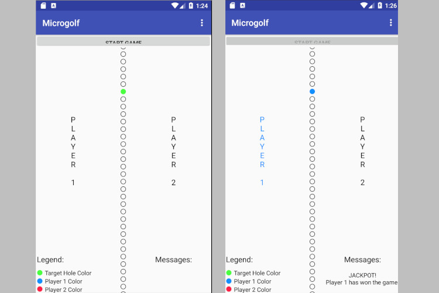

# microgolf
Microgolf using treads

This project is a strategy game called Microgolf. The layout of Microgol fconsists of 50 “holes” arranged in a vertical line. One of the holes is randomly designated by the UI thread as the winning hole. Two worker threads take turns shooting a virtual ball into a hole of their choosing. The first thread to shoot its ball into the winn hole wins the game. Here are additional details on this game.

- The 50 holes are partitioned into 5 “hole groups”. Each group contains 10 adjacent holes. - Whenever one of the two player threads shoots a ball into a hole, the game system provides one of four possible responses: 
    1. Jackpot — This happens if the thread shot the ball into the winning hole.
    2. Nearmiss — This happens if the thread missed the winning hole, but shot in to hole in the same group as the winning hole.
    3. Near group — This happens if the thread shot a ball into a hole whose group is adjacent to the group containing the winning hole.
    4. Big miss — This happens if ball misses by more than one group. 
    5. Catastrophe — This happens if the ball falls into a hole already currently occupied by the other player’s ball. In this case, the player is immediately disqualified and the other player wins the game. 

- Threads have can choose one of three possible shots. 
    1. Random — This shot will end in any of the fifty possible holes. This is the only option available when a thread makes its first move.
    2. Close group — This shot will end in a random hole either in the same group as the previous shot by the same player, or an adjacent group.
    3. Same group — This shot will end in a random hole in the same group as the previous shot by the same player.
    4. Target hole — This shot will end in a hole specified by a player thread. An additional constraint is that a thread will never shoot in the same hole twice during an entire game, no matter what kind of shot the thread chose.

- Each worker thread will take turns with the other thread taking the following actions:
    1. Waiting for a short time (1-2seconds)in order for a human viewer to take note of the previous move on the display.
    2. Figuring out the next shot of this thread.
    3. Communicating this shot to the UI thread.
    4. Waiting for a response from the UI thread.
- The UI thread is specifically responsible for the following functionality:
    1. Showing the current hole display. The display includes a vertical array of the holes, highlight the winning hole, as well as the most recent shots by the two player threads. 
    2. Notifying player threads of the outcome of their shots.
    3. Updating the display after each shot.
    4. Determining whether one player has won the game.
    5. Signaling the two worker threads that the game is over.
    6. Displaying the outcome of the game in the UI. 

    